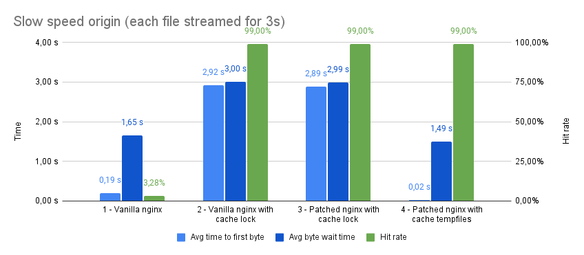

# Nginx tempfiles benchmark

## How to run

1. Obtain two nginx binaries and place them into this folder:
   * `nginx-vanilla` - nginx binary builded without any patches
   * `nginx` - nginx binary builded with tempfiles patch
2. Run benchmark by executing `./run.sh`

## How tests works

Nginx is set up to proxy_pass all requests to the origin with caching enabled.

Origin serves each request with continuous stream of random bytes for given
amount of seconds (3 seconds by default, 10MiB/s rate).

Client runs N paralel workers, each of the workers sends request for file-0,
file-1, file-2, ... until time limit is reached (default: 30 seconds and 100
workers).

## Test cases

There are three test suites:

1. Full speed origin - Origin returns files with its full speed. Typical
   situation with quick origin server with static files.
2. Slow speed origin (each file streamed for 1s) - Origin sends file with
   constant speed in 10 chunks. This could be a slow origin server on
   slow network or a live video streaming service with short chunks.
3. Slow speed origin (each file streamed for 3s) - Origin sends file with
   constant speed in 30 chunks (10 chunks per second). This is typical example
   of live video streaming service.

In each test suites there were four instances of the nginx compared:

1. Vanilla nginx without cache lock and tempfiles - This is the most basic
   caching setup when every MISS is proxy passed to the origin. Already cached
   files are server from the cache.
2. Vanilla nginx with cache lock - This nginx does only one request for the same
   file to the origin, other requests for the same file are paused and are served
   when the file is fully cached. This is common technique to lower load to the
   origin in high-demand scenarios.
3. Patched nginx with cache lock - This is same scenario as 2. but with patched
   binary. This is just an check that tempfiles patch does not degraded
   performance.
4. Patched nginx with cache tempfiles - As in 2. this nginx does only one request
   for the same file to the origin, but other request are not paused. They are
   served on-the-fly from the same cache tempfile.

## Results

### Full speed origin

In this situation cache lock and cache tempfiles are both comparable good.

### Slow speed origin (each file streamed for 1s)

Vanilla nginx is overloaded by concurrent tempfiles creation and has very low
hit ratio. Cache lock solves hit ratio, but there is a large wait time for the
first byte and average byte wait time. Cache tempfiles dominates them both
because there is no overload from multiple tempfiles but the time to the first
byte is almost instant and files are served to all clients as quick, as origin
sends them.

### Slow speed origin (each file streamed for 3s)

Similar to the previous situation but vanilla nginx has almost no hits.
Cache tempfiles nginx dominates the situation, better than anything else.

### All results

1. Full speed origin - Origin returns files with its full speed. Typical
   situation with quick origin server with static files.
2. Slow speed origin (each file streamed for 1s) - Origin sends file with
   constant speed in 10 chunks. This could be a slow origin server on
   slow network or a live video streaming service with short chunks.
3. Slow speed origin (each file streamed for 3s) - Origin sends file with
   constant speed in 30 chunks (10 chunks per second). This is typical example
   of live video streaming service.

* **requests** = Count of requests (sended from client/received on origin)
* **bytes** = Count of bytes in payload (sended from client/received on origin)
* **avg Mbps** = number of bits divided by total run time on client/origin
* **Avg byte wait time** = Special metric indicating how long the client had to
  wait for bytes of the file. When client receives a chunk of bytes, it adds
  <chunk_size> * <time_from_this_request_start> to the counter. Finally this is
  divided by the total number of bytes.
* **Avg time to first byte** = Average time before client receives the first
  chunk of the content.
* **Hit rate** = How many of the client requests were delivered from cache
  without contacting origin.

| Full speed origin                      | requests | bytes       | avg Mbps | requests | bytes        | avg Mbps | Avg byte wait time | Avg time to first byte | Hit rate
|----------------------------------------|----------|-------------|----------|----------|--------------|----------|--------------------|------------------------|---------
| 1 - Vanilla nginx                      | 172      | 5410652160  | 1426.52  | 5707     | 179526696960 | 47329.51 | 0.31 s             | 0.09 s                 | 96,99%
| 2 - Vanilla nginx with cache lock      | 55       | 1730150400  | 455.70   | 5181     | 162980167680 | 42925.05 | 0.34 s             | 0.10 s                 | 98,94%
| 3 - Patched nginx with cache lock      | 56       | 1761607680  | 464.75   | 5141     | 161721876480 | 42662.65 | 0.34 s             | 0.10 s                 | 98,91%
| 4 - Patched nginx with cache tempfiles | 60       | 1887436800  | 499.12   | 5198     | 163510173227 | 43237.53 | 0.33 s             | 0.09 s                 | 98,85%
| **Slow speed origin (file_time: 1)**   | requests | bytes       | avg Mbps | requests | bytes        | avg Mbps | Avg byte wait time | Avg time to first byte | Hit rate
| 1 - Vanilla nginx                      | 917      | 28846325760 | 7405.90  | 2020     | 63543705600  | 16312.78 | 0.86 s             | 0.11 s                 | 54,60%
| 2 - Vanilla nginx with cache lock      | 30       | 943718400   | 242.76   | 2929     | 92138373120  | 23700.89 | 0.97 s             | 0.90 s                 | 98,98%
| 3 - Patched nginx with cache lock      | 30       | 943718400   | 243.03   | 2948     | 92736061440  | 23880.69 | 0.97 s             | 0.90 s                 | 98,98%
| 4 - Patched nginx with cache tempfiles | 30       | 943718400   | 245.29   | 3000     | 94371833907  | 24527.75 | 0.50 s             | 0.02 s                 | 99,00%
| **Slow speed origin (file_time: 1)**   | requests | bytes       | avg Mbps | requests | bytes        | avg Mbps | Avg byte wait time | Avg time to first byte | Hit rate
| 1 - Vanilla nginx                      | 915      | 28783411200 | 7026.24  | 946      | 29758586880  | 7263.74  | 1.65 s             | 0.19 s                 |  3,28%
| 2 - Vanilla nginx with cache lock      | 10       | 314572800   | 81.30    | 1000     | 31457280000  | 8129.40  | 3.00 s             | 2.92 s                 | 99,00%
| 3 - Patched nginx with cache lock      | 10       | 314572800   | 81.14    | 1000     | 31457280000  | 8113.45  | 2.99 s             | 2.89 s                 | 99,00%
| 4 - Patched nginx with cache tempfiles | 10       | 314572800   | 82.64    | 1000     | 31457280000  | 8262.88  | 1.49 s             | 0.02 s                 | 99,00%
